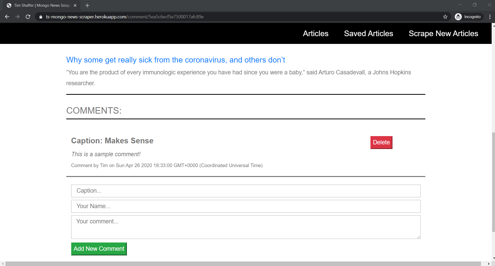

# mongo-news-scraper
A Full Stack application using the **MVC** design pattern.  

Scrape some current news articles from **The Philadelphia Inquirer** and store the Headline, Summary, Author, and Link in a MongoDB database.  Click the Links to view the full article on a separate page.  Save an article if you would like, and then add some comments.  Comments can be deleted from Saved Articles and Articles can be removed from the saved designation.  Clear any unsaved articles that do not have comments (Comments need to be deleted before the article can be cleared!) 

Check back occassionally to *Scrape New Articles!*

# Author 
> Tim Shaffer

## Contents
* [Deployment](#deployment)
* [Tech Used](#tech-used)
* [File Structure](#mvc-directory-structure)
* [Instructions](#instructions)


## Deployment
The app is deployed to **HEROKU** at the following link:  https://ts-mongo-news-scraper.herokuapp.com/

## Tech Used
* JavaScript
* Node.js
    * Axios
    * Cheerio
    * Express
    * Express-Handlebars
    * Mongoose
* HTML 
* CSS
* Bootstrap
* jQuery
* MongoDB

### MVC Directory Structure

```bash
📦mongo-news-scraper
    📦controllers
    ┣ 📜articles_controller.js
    ┗ 📜comments_controller.js
    📦models
    ┣ 📜Article.js
    ┣ 📜Comment.js
    ┗ 📜index.js
    📦node_modules
    📦public
    ┗ 📂assets
    ┃ ┣ 📂css
    ┃ ┃ ┗ 📜style.css
    ┃ ┣ 📂images
    ┃ ┃ ┗ 📜philly_skyline.jpg
    ┃ ┗ 📂js
    ┃ ┃ ┗ 📜app.js
    📦views
    ┣ 📂layouts
    ┃ ┗ 📜main.handlebars
    ┣ 📂partials
    ┃ ┣ 📂articles
    ┃ ┃ ┗ 📜article-block.handlebars
    ┃ ┣ 📂comments
    ┃ ┃ ┗ 📜comments-block.handlebars
    ┃ ┗ 📂saved
    ┃ ┃ ┗ 📜saved-block.handlebars
    ┣ 📜articles.handlebars
    ┣ 📜comments.handlebars
    ┣ 📜index.handlebars
    ┣📜saved.handlebars
    📦z_Screenshots
    ┣ 📜.gitignore
    ┣ 📜package-lock.json
    ┣ 📜package.json
    ┣ 📜README.md
    ┗ 📜server.js
```

# Instructions

1. Clicking the **HEROKU** link - https://ts-mongo-news-scraper.herokuapp.com/ - will take you to the Home Page.

    

1. From the Hompage, use the Navigation Links to proceed through the application.

    * Clicking the **Articles** link will easy-scroll to the Articles section of the page.

        

    * Clicking the **Saved Articles** link will access the DB to find any Saved Articles and then easy-scroll to the Saved Articles section of the page.

        

    * Clicking the **Scrape New Articles** link will scrape new Articles from the current *Philadelphia Inquirer* homepage and save them to the DB.  It will then refresh the page and easy-scroll to Articles section of the page, displaying the articles from the DB.

        

1. Each Article in the Articles Section has the following:  

    

    * A **Headline\Link** that can be clicked to take you to the full article.
    * A **Summary** that briefly describes the article.
    * The **Author(s)**..
    * A **Save** button that can be clicked to mark this article as *Saved*.  When Saved, the article is removed from the *Articles* Section and will be displayed within the *Saved Articles* section.

1. After saving the above shown article, the *Articles* section is refreshed and that article is no longer displayed.

    

1. Clicking the **Saved Articles** link will again access the DB to find any Saved Articles and then easy-scroll to the *Saved Articles* section of the page.

    

1. Each Article in the Saved Articles Section has the following:  

    

    * A **Headline\Link** that can be clicked to take you to the full article.
    * A **Summary** that briefly describes the article.
    * The **Author(s)**.
    * (A) - **Comments** button that can be clicked to view and\or add *Comments* on the given article.
    * (B) - **Remove Saved** button that can be clicked to remove the *Saved* designation from the given article.  When clicked, the article is removed from the *Saved Articles* Section and will be available to be displayed within the *Articles* section.

1. After clicking the *Comments* button, the *Comments* section is displayed. 

    

1. The Article in the Comment Section has the following:  

    

    * A **Headline\Link** that can be clicked to take you to the full article.
    * A **Summary** that briefly describes the article.
    * Enter your comment in the **Comment Form** and then click the **Add New Comment** button to save your comment.  

1. Enter the Information for the comment.  All of the information is required for it to be saved.  Leaving any detail empty will just refresh the screen!  

    

1. Clicking the **Add New Comment** button will just refresh the screen!  

    

1. With all of the information filled in -   

    

1. Clicking the **Add New Comment** button will add the comment to the database and refresh the comments section for the given article.  

    

1. Multiple comments can be added in the same manner and will appear in the comments section for the given article.  

    

1. Each Comment for a given article has the following:  

    

    * A **Caption** .
    * The **Comment** details.
    * The **Commenter** and the **Date/Time** of when the comment was saved.  
    * A **Delete** button that can be clicked to delete the comment from the DB.  The comment will be completely deleted!

1. Clicking the **Delete** button will delete the comment from the database and refresh the comments section for the given article.  

    

1. Clicking the **Saved Articles** link to return to the *Saved Articles* section.

    

1. To verify that the Comment(s) are still in the DB, Clicking the **Comments** button to return to the *Comments* section will show any comments in the DB for the given article.

    

1. Once again, Clicking the **Saved Articles** link to return to the *Saved Articles* section.

    

1. Now clicking the **Remove Saved** button will remove the article from being saved and the *Saved Articles* section is refreshed and that article is no longer displayed.

    

1. Clicking the **Articles** link will refresh the page and easy-scroll to Articles section of the page, displaying the articles from the DB including the article that was previously saved!

    

1. Scroll through all the **Articles** on the page and scrape new articles whenever you want.  Only **NEW** articles will be added to the page!

    

    

1. Manage the **Articles** and remove any old, outdated, or no longer wanted from the database by pressing the **Clear Articles** button. This will clear all *unsaved* articles from the DB...but it will leave those that still have corresponding comments, even though they are not saved!

    

    * *Remember this was the sample article and we didn't delete all of the comments*.

1. Click the **Save** button and then the **Saved Articles** link - 

    

1. To verify that the Comment(s) are still in the DB, Clicking the **Comments** button to return to the *Comments* section will show any comments in the DB for the given article.

    


1. Now, clicking the **Delete** button will delete that comment from the database and refresh the comments section for the given article.  

    

1. Once again, Clicking the **Saved Articles** link to return to the *Saved Articles* section.

    

1. Now clicking the **Remove Saved** button will remove the article from being saved and the *Saved Articles* section is refreshed and that article is no longer displayed.

    

1. Clicking the **Articles** link will refresh the page and easy-scroll to Articles section of the page, displaying the articles from the DB including the article that was previously saved!

    

1. Now clicking the **Clear Articles** button will remove that last article from the database and the DB is completely clean...waiting for new articles to be scraped! 

    